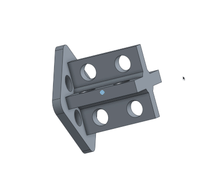

# Poppy Soft Connector

This repository gather information useful to make soft parts compatible with Poppy robots. It currently includes:

- [beta connector](beta_connector): [[stl]](beta_connector/beta_connector.stl) [[onshape]](https://cad.onshape.com/documents/56af95b6e4b06a92e0eda720/w/a53eaed345df8e54532db1e2/e/a165c83ad81843f33ed38c05)

You can [find and modify the design on onshape](https://cad.onshape.com/documents/56af95b6e4b06a92e0eda720/w/a53eaed345df8e54532db1e2/e/a165c83ad81843f33ed38c05) with all the molds for [poppy-soft-starfish](https://github.com/poppy-project/poppy-soft-starfish)
(Note: If the link does not work, run a search for ''Poppy Soft Robot XL320'')

### Examples

[Video tutorial](https://youtu.be/B3CZs55AJQo)

The following creatures include soft parts:
- [poppy-soft-starfish](https://github.com/poppy-project/poppy-soft-starfish)

### Contributing

Do not hesitate to add your connector by [forking](https://help.github.com/articles/fork-a-repo/) and issuing a [pull request](https://help.github.com/articles/using-pull-requests/). [[Another useful link]](https://gun.io/blog/how-to-github-fork-branch-and-pull-request/)

If you are not familiar with this, you can also simply post on [our forum](https://forum.poppy-project.org/) and, with your approval, we will add your work on this repository.

### License

All the technological development work made in the Poppy project is freely available under open source licenses. Only the name usage *"Poppy"* is restricted and protected as an international trademark, please contact us if you want to use it or have more information.

|   License     |     Hardware    |   Software      |
| ------------- | :-------------: | :-------------: |
| Title  | [Creatives Commons BY-SA](http://creativecommons.org/licenses/by-sa/4.0/)  |[GPL v3](http://www.gnu.org/licenses/gpl.html)  |
| Logo  |   |  |
